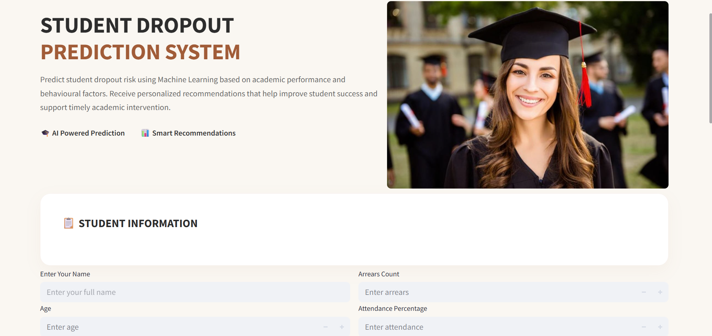
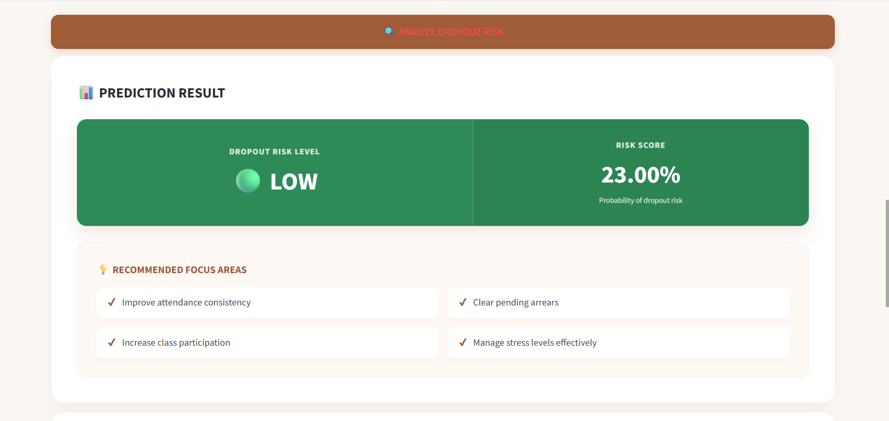
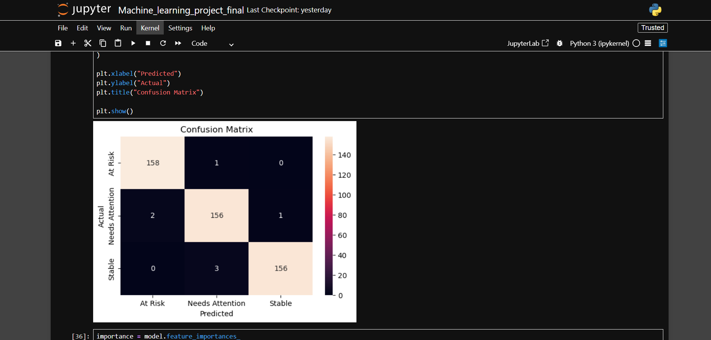
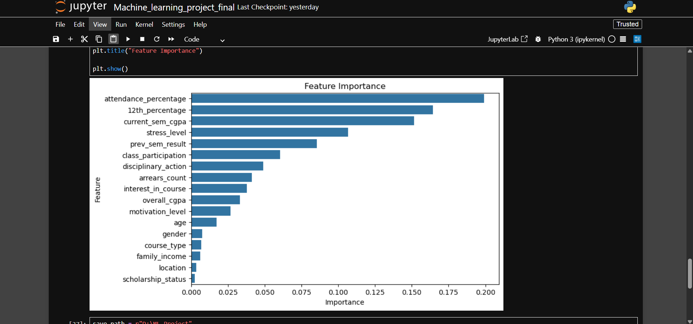

# 🎓 Student Dropout Prediction Using Supervised Machine Learning

## 📌 Project Overview

Student dropout is one of the major challenges faced by educational institutions. This project uses **Supervised Machine Learning** to predict the dropout risk of students based on their academic performance and behavioural factors. The system helps identify students who may require early intervention by providing a **dropout risk level**, **risk score**, and **personalized recommendations** to improve academic performance and student retention.

---

## ✨ Key Features

* 🎯 Predicts Student Dropout Risk
* 📊 Displays Dropout Risk Score
* 💡 Personalized Improvement Recommendations
* 🖥️ Interactive Web Application using Streamlit
* 🤖 Machine Learning based Prediction System
* 📈 Feature Importance Visualization
* 📉 Confusion Matrix for Model Evaluation

---

## 🛠️ Technologies Used

| Technology   | Purpose                |
| ------------ | ---------------------- |
| Python       | Programming Language   |
| Pandas       | Data Processing        |
| NumPy        | Numerical Computing    |
| Scikit-learn | Machine Learning       |
| Streamlit    | Web Application        |
| Matplotlib   | Data Visualization     |
| Seaborn      | Graphs & Charts        |
| Joblib       | Model Saving & Loading |

---

## 📊 Dataset Features

The prediction model uses the following student attributes:

* Age
* Gender
* Location
* 12th Percentage
* Course Type
* Current Semester CGPA
* Overall CGPA
* Previous Semester Result
* Arrears Count
* Attendance Percentage
* Class Participation
* Stress Level
* Motivation Level
* Interest in Course
* Family Income
* Scholarship Status
* Disciplinary Action

---

## 🤖 Machine Learning Model

**Algorithm Used:** Random Forest Classifier

### Model Development Process

* Data Cleaning
* Label Encoding
* Train-Test Split
* Hyperparameter Tuning using RandomizedSearchCV
* Model Training
* Performance Evaluation
* Model Deployment using Streamlit

---

## 📈 Application Output

The application predicts:

* ✅ Dropout Risk Level (Low / Moderate / High)
* ✅ Risk Score (%)
* ✅ Personalized Recommendations

---

## 📷 Project Screenshots

### 🏠 Home Page



---

### 🎯 Prediction Result



---

### 📊 Confusion Matrix



---

### 📈 Feature Importance



---

## 🌐 Live Demo

🔗 **Live Application:** https://student-dropout-prediction-varshini-vasudevan.streamlit.app/

---

## 📂 Project Structure

```text
Student_Dropout_Prediction_Project
│
├── app_streamlit.py
├── Machine_learning_project_final.ipynb
├── requirements.txt
├── README.md
├── risk_prediction_model.pkl
├── encoders.pkl
├── target_encoder.pkl
├── student_dataset.xlsx
│
└── images
    ├── homepage.png
    ├── prediction.png
    ├── confusion_matrix.png
    └── feature_importance.png
```

---

## ▶️ How to Run

### 1. Clone the Repository

```bash
git clone https://github.com/your-username/student-dropout-prediction.git
```

### 2. Install Required Libraries

```bash
pip install -r requirements.txt
```

### 3. Run the Application

```bash
streamlit run app_streamlit.py
```

---

## 🚀 Future Enhancements

* Explainable AI (SHAP / LIME)
* Deep Learning Based Prediction
* Student Performance Dashboard
* Real-time Data Integration
* Cloud Deployment

---

## 👩‍💻 Developed By

**Varshini V**

Artificial Intelligence and Data Science Graduate

📧 Passionate about Machine Learning, Data Analytics, Artificial Intelligence, and building data-driven solutions.

⭐ If you found this project useful, consider giving this repository a **Star** on GitHub!
